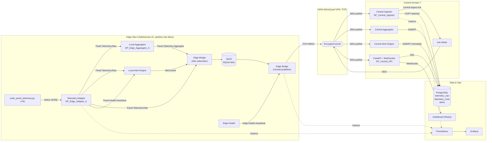

# HelioStream — Distributed Solar Panel Telemetry Platform
## System Architecture & Implementation Design (RTI Connext DDS + PostgreSQL)

> **Scope.** End-to-end design for ingesting streaming telemetry from `solar_panel_telemetry.py`, transporting it resiliently over unreliable rural links using **RTI Connext DDS (free edition)**, persisting it in **PostgreSQL**, and exposing it through a dashboard and alerting layer. Designed to be professional and demo-ready, while staying implementable by a small student team.

---

## 1. System Vision

HelioStream is a two-tier distributed telemetry platform for solar farms:

- **Edge tier** — one small Linux machine (industrial PC, NUC, or Raspberry Pi 4/5) per physical site, colocated with the panels and inverters. It ingests raw samples from one or more `solar_panel_telemetry.py` processes (the stand-ins for real panel-side devices), publishes them on a **local DDS domain**, buffers them durably during WAN outages, and forwards them to the central tier when connectivity is healthy.
- **Central tier** — a set of cooperating services in a datacenter or cloud VPC that subscribe to forwarded telemetry, compute aggregates and alerts, persist everything into PostgreSQL, and serve a web dashboard.

Primary goals, in priority order:

1. **Do not lose data.** Rural links drop; the edge must spool locally and replay without producing duplicates.
2. **Real-time visibility when online.** Sub-second pub/sub inside a site; seconds-level WAN propagation.
3. **Durable history and analytics.** PostgreSQL stores the full aggregated time series plus all alerts and all raw samples deemed relevant.
4. **Operable.** Health of every edge node, every panel, and every service is observable.
5. **Extensible.** New topics (weather, inverter, battery) and new consumers (ML anomaly detection, billing) can be added without reworking the core.

Design non-goals (explicit): DDS Security, cross-WAN native DDS discovery, and anything that depends on RTI’s commercial add-ons (Routing Service, Persistence Service, Recording Service, Monitor, Cloud Discovery Service). Those are replaced with open, application-level equivalents.

---

## 2. Best Architecture Choice

**Chosen style: edge-to-central, event-driven, modular services, with store-and-forward bridging over a WAN VPN.**

Each tier internally looks like a small set of single-purpose services communicating over DDS. Between tiers, a custom Python **Edge Bridge** relays DDS samples from the local site domain to the central domain over a VPN/TCP link with a durable on-disk spool.

Why this shape:

| Candidate | Verdict | Reasoning |
|---|---|---|
| Monolith | Rejected | Fails the "central outage must not break the edge" requirement. |
| Native DDS over WAN (single domain, public routable multicast/unicast) | Rejected | Free RTI DDS has no Cloud Discovery Service; discovery over NAT/unreliable WAN is brittle. DDS is designed for LANs. |
| DDS + Routing Service for WAN | Rejected | Routing Service is **not in the free edition**. |
| Kafka instead of DDS | Rejected | Requirement is DDS; also heavier on edge hardware. |
| **Per-site local DDS domain + custom Python bridge + central DDS domain** | **Chosen** | Keeps DDS strengths where they shine (LAN real-time pub/sub), uses a simple TCP spool-and-forward for WAN, survives outages cleanly, and fits the free edition. |

This gives us DDS-native real-time decoupling inside the site (Publisher ⇄ Subscriber with QoS), a well-defined chokepoint for WAN resilience (the bridge), and a clean landing zone centrally where many consumers can subscribe without the producers ever knowing.

---

## 3. RTI DDS Design

### 3.1 Domains

Two domain IDs are used to isolate local site traffic from central traffic:

| Domain ID | Name | Scope | Participants |
|---|---|---|---|
| `42` | `SiteDomain` | One per edge site (same ID reused per site, domains are network-scoped) | Telemetry adapters, local aggregator, local alert engine, edge bridge (subscriber side) |
| `7`  | `CentralDomain` | Single central datacenter domain | Edge bridges (publisher side), central ingestion, central aggregator, alert engine, API backend |

Sites are network-isolated from each other (VPN tunnel terminates at the central bridge host), so reusing domain `42` across sites is safe — there is no cross-site DDS discovery.

### 3.2 DomainParticipants (naming convention)

- `DP_Edge_Adapter_<site>` — reads simulator, publishes raw telemetry on `SiteDomain`.
- `DP_Edge_Aggregator_<site>` — local rollups and health.
- `DP_Edge_Bridge_Site_<site>` — subscriber on `SiteDomain`.
- `DP_Edge_Bridge_Central_<site>` — publisher on `CentralDomain`, tagged with site.
- `DP_Central_Ingestor` — primary subscriber on `CentralDomain`.
- `DP_Central_Aggregator`, `DP_Central_AlertEngine`, `DP_Central_API` — additional central subscribers (DDS lets us add as many as we want without telling the publisher).

### 3.3 Topic Catalog

All topics are **keyed** (DDS instance semantics) so that per-panel, per-edge, per-alarm instances can be tracked independently — this also enables Ownership, Deadline, and Liveliness to operate per instance rather than per stream.

**Partitions** are used to segregate sites at the central domain: writers tag themselves with partition `"site.<site_id>"`, and a consumer that sets `"site.*"` gets all of them. This keeps the topic catalog small while still enabling per-site filtering.

| # | Topic Name | Domain | Producer | Consumer | Key | Purpose |
|---|---|---|---|---|---|---|
| 1 | `Panel.Telemetry.Raw` | Site `42` | Edge Adapter | Edge Aggregator, Edge Alert Engine, Edge Bridge | `panel_id` | One sample per panel per tick from the simulator. |
| 2 | `Panel.Telemetry.Aggregate` | Site `42` and Central `7` | Aggregator (edge and central) | Dashboard API, DB Writer | `panel_id` + `window` | 1‑min / 5‑min rollups of power, energy, availability. |
| 3 | `Site.Telemetry.Aggregate` | Central `7` | Central Aggregator | Dashboard API, DB Writer | `site_id` + `window` | Site-level rollups. |
| 4 | `Panel.Health.Heartbeat` | Site `42` | Edge Adapter (one per panel) | Alert Engine, Bridge | `panel_id` | Liveliness signal for each panel. |
| 5 | `Edge.Health.Heartbeat` | Central `7` | Edge Bridge | Central Ingestor, API | `edge_id` | Liveliness of the edge node itself. |
| 6 | `Alert.Event` | Site `42` and Central `7` | Alert Engine (edge and central) | DB Writer, Dashboard API | `alert_id` | Typed fault/alert lifecycle events. |
| 7 | `Central.Ingest.Ack` | Central `7` | Central Ingestor | Edge Bridge | `seq` (per edge) | Optional end-to-end ACK that lets the edge trim its spool. |
| 8 | `Control.Command` | Central `7` → Site `42` (via bridge reverse path) | API Backend | Edge Adapter | `command_id` | Restart, reconfigure, change sampling rate. |
| 9 | `Config.Update` | Central `7` → Site `42` | API Backend | Edge Adapter, Aggregator | `config_scope` + `config_key` | Config push with TRANSIENT_LOCAL so late joiners get it. |
| 10 | `System.Health` | Central `7` | Every central service | Dashboard API | `service_id` | Self-reported service health and metrics. |

### 3.4 Publishers, Subscribers, DataWriters, DataReaders

A practical rule: **one Publisher per DomainParticipant per partition-group, one Subscriber per DomainParticipant**, and many DataWriters/DataReaders underneath. QoS is applied at topic/entity level.

Example (edge adapter):

```
DP_Edge_Adapter_A
 ├── Publisher (partition = "site.SiteA")
 │    ├── DataWriter on Panel.Telemetry.Raw      (RELIABLE, KEEP_LAST 100)
 │    └── DataWriter on Panel.Health.Heartbeat   (BEST_EFFORT, KEEP_LAST 1)
 └── Subscriber (partition = "site.SiteA")
      ├── DataReader on Control.Command          (RELIABLE, TRANSIENT_LOCAL)
      └── DataReader on Config.Update            (RELIABLE, TRANSIENT_LOCAL)
```

### 3.5 Features to use from the free edition

- All standard **QoS** policies (Reliability, Durability up to TRANSIENT_LOCAL, History, Resource Limits, Deadline, Liveliness, Ownership, Partition, Batching, Asynchronous Publisher).
- **Content-Filtered Topics** (for example, "only panels where `status != 'OK'`").
- **Request-Reply** pattern (used optionally for `Control.Command`).
- **DynamicData** or IDL-generated types.

### 3.6 Features to **avoid** (not in free edition, or brittle without add-ons)

- **DDS Security** — no authentication, access control, or encryption plugins. Use VPN + app-level HMAC instead (see §9).
- **Routing Service** — no native WAN bridging. Replaced by the custom Python Edge Bridge.
- **Persistence Service** — so `TRANSIENT` and `PERSISTENT` DURABILITY are off-limits. Use `VOLATILE` or `TRANSIENT_LOCAL` only. Long-term persistence is PostgreSQL.
- **Recording Service** — use the PostgreSQL raw table or an offline JSONL dump instead.
- **Cloud Discovery Service** — don’t try to discover across the WAN.
- **Monitor / Admin Console** — replaced by Prometheus + Grafana for metrics.

---

## 4. PostgreSQL Integration

### 4.1 What goes where

| Data | Destination | Cadence | Why |
|---|---|---|---|
| Site/panel/edge metadata | `sites`, `strings`, `panels`, `edge_nodes` | On provisioning | Slow-changing reference. |
| Raw per-panel samples | `telemetry_raw` (time-partitioned) | Batched, every 5s or 1000 rows | Forensic fidelity; filtered/downsampled for long-term. |
| 1-min rollups | `telemetry_1min` | Once per minute per panel | Default dashboard resolution. |
| 1-hour rollups | `telemetry_1hour` | Once per hour per panel | Long-horizon trends, lower storage cost. |
| Alerts | `alerts` | **Immediately**, non-batched | Human-visible events must not be delayed. |
| Edge/service health | `edge_health`, `service_health` | Every 10s–60s | For ops dashboards. |
| Commands issued | `commands_audit` | Immediately | Audit trail. |
| Ingestion stats | `ingestion_stats` | Every minute | Lag/throughput tracking. |

### 4.2 Schema (PostgreSQL 14+, no extensions required)

```sql
CREATE TABLE sites (
    site_id        TEXT PRIMARY KEY,
    name           TEXT NOT NULL,
    latitude       DOUBLE PRECISION,
    longitude      DOUBLE PRECISION,
    timezone       TEXT NOT NULL DEFAULT 'UTC',
    commissioned   DATE,
    notes          TEXT
);

CREATE TABLE edge_nodes (
    edge_id        TEXT PRIMARY KEY,
    site_id        TEXT NOT NULL REFERENCES sites(site_id),
    hostname       TEXT,
    version        TEXT,
    last_seen      TIMESTAMPTZ
);

CREATE TABLE strings (
    string_id      TEXT NOT NULL,
    site_id        TEXT NOT NULL REFERENCES sites(site_id),
    PRIMARY KEY (site_id, string_id)
);

CREATE TABLE panels (
    panel_id        TEXT PRIMARY KEY,
    site_id         TEXT NOT NULL REFERENCES sites(site_id),
    string_id       TEXT NOT NULL,
    p_stc_w         REAL,
    orientation_deg REAL,
    tilt_deg        REAL,
    installed_on    DATE,
    FOREIGN KEY (site_id, string_id) REFERENCES strings(site_id, string_id)
);
CREATE INDEX panels_site_string_idx ON panels(site_id, string_id);

-- Raw telemetry: declared as a PARTITIONED table by month.
-- This keeps each partition small enough to index efficiently and
-- makes retention a matter of dropping old partitions.
CREATE TABLE telemetry_raw (
    ts              TIMESTAMPTZ NOT NULL,
    panel_id        TEXT NOT NULL,
    site_id         TEXT NOT NULL,
    string_id       TEXT NOT NULL,
    edge_seq        BIGINT NOT NULL,         -- per-edge monotonic counter; used for dedup
    edge_id         TEXT NOT NULL,
    power_w         REAL,
    voltage_v       REAL,
    current_a       REAL,
    irradiance_wm2  REAL,
    ambient_temp_c  REAL,
    cell_temp_c     REAL,
    status          TEXT,
    fault           TEXT,
    PRIMARY KEY (edge_id, edge_seq, ts)     -- (edge_seq, edge_id) guarantees dedup; ts for partitioning
) PARTITION BY RANGE (ts);

CREATE INDEX telemetry_raw_panel_ts_idx ON telemetry_raw (panel_id, ts DESC);
CREATE INDEX telemetry_raw_site_ts_idx  ON telemetry_raw (site_id, ts DESC);

-- Example partition; a small cron or pg_partman-equivalent job creates these ahead of time.
CREATE TABLE telemetry_raw_2026_04 PARTITION OF telemetry_raw
    FOR VALUES FROM ('2026-04-01') TO ('2026-05-01');

CREATE TABLE telemetry_1min (
    bucket_start    TIMESTAMPTZ NOT NULL,
    panel_id        TEXT NOT NULL,
    site_id         TEXT NOT NULL,
    samples         INT NOT NULL,
    power_avg_w     REAL,
    power_max_w     REAL,
    energy_wh       REAL,
    voltage_avg_v   REAL,
    current_avg_a   REAL,
    irradiance_avg  REAL,
    cell_temp_max   REAL,
    availability    REAL,     -- fraction of the bucket where status='OK'
    PRIMARY KEY (panel_id, bucket_start)
) PARTITION BY RANGE (bucket_start);
CREATE INDEX telemetry_1min_site_bucket_idx ON telemetry_1min(site_id, bucket_start DESC);

CREATE TABLE telemetry_1hour (LIKE telemetry_1min INCLUDING ALL) PARTITION BY RANGE (bucket_start);

CREATE TABLE alerts (
    alert_id        UUID PRIMARY KEY,
    opened_at       TIMESTAMPTZ NOT NULL,
    closed_at       TIMESTAMPTZ,
    severity        TEXT NOT NULL CHECK (severity IN ('INFO','WARNING','FAULT','CRITICAL')),
    fault_code      TEXT NOT NULL,           -- SHADING / HOTSPOT / STRING_OPEN / INVERTER_TRIP / SOILING / STALE_PANEL / EDGE_OFFLINE
    site_id         TEXT,
    panel_id        TEXT,
    edge_id         TEXT,
    details         JSONB NOT NULL DEFAULT '{}'::jsonb,
    acknowledged_by TEXT,
    acknowledged_at TIMESTAMPTZ
);
CREATE INDEX alerts_open_idx   ON alerts(opened_at DESC) WHERE closed_at IS NULL;
CREATE INDEX alerts_site_idx   ON alerts(site_id, opened_at DESC);
CREATE INDEX alerts_panel_idx  ON alerts(panel_id, opened_at DESC);

CREATE TABLE commands_audit (
    command_id     UUID PRIMARY KEY,
    issued_at      TIMESTAMPTZ NOT NULL,
    issued_by      TEXT NOT NULL,
    edge_id        TEXT,
    panel_id       TEXT,
    kind           TEXT NOT NULL,     -- RESTART_ADAPTER / SET_SAMPLE_RATE / TOGGLE_FAULT_INJECT / ...
    payload        JSONB NOT NULL,
    ack_at         TIMESTAMPTZ,
    ack_status     TEXT
);

CREATE TABLE service_health (
    service_id     TEXT NOT NULL,
    ts             TIMESTAMPTZ NOT NULL,
    status         TEXT NOT NULL,
    metrics        JSONB NOT NULL,
    PRIMARY KEY (service_id, ts)
);

CREATE TABLE ingestion_stats (
    edge_id        TEXT NOT NULL,
    ts             TIMESTAMPTZ NOT NULL,
    received       BIGINT NOT NULL,
    written        BIGINT NOT NULL,
    duplicates     BIGINT NOT NULL,
    lag_ms_p50     INT,
    lag_ms_p99     INT,
    PRIMARY KEY (edge_id, ts)
);
```

### 4.3 Indexing strategy

- **Primary keys chosen for idempotency first, access pattern second.** On `telemetry_raw`, `(edge_id, edge_seq, ts)` is naturally unique (dedup on replay) and lets `INSERT ... ON CONFLICT DO NOTHING` become a no-op silently.
- **Descending secondary indexes on `ts`** because dashboard queries are almost always "last N minutes".
- **Partial index on open alerts** keeps the alarm panel snappy.
- **JSONB GIN indexes** only added when a specific query needs them; otherwise avoid the write cost.

### 4.4 Retention

- `telemetry_raw`: **30 days**, then drop the partition. This is cheap and instant because of range partitioning.
- `telemetry_1min`: **1 year**.
- `telemetry_1hour`: **indefinitely** (tiny).
- `alerts`: **indefinitely** (audit-grade).
- `service_health`, `ingestion_stats`: **90 days**.

### 4.5 TimescaleDB (optional)

If the environment permits installing the extension, **TimescaleDB is a natural fit** for `telemetry_raw`, `telemetry_1min`, and `telemetry_1hour`. Benefits: automatic hypertable partitioning, continuous aggregates (replaces the 1-min and 1-hour rollup jobs), and compression of older chunks. The schema above was intentionally designed so that `SELECT create_hypertable(...)` is the only migration needed. Treat it as an optional lever, not a dependency.

---

## 5. Edge Node Design

The edge node is a small set of cooperating Python processes, supervised by `systemd` (or Docker Compose for the demo). Each process is restart-safe.

### 5.1 Components

1. **Telemetry Adapter** — runs `solar_panel_telemetry.py` as a child process in JSONL mode, or tails a JSONL file the simulator is writing. For each record: validates schema, stamps an `edge_seq` monotonic counter, publishes on `Panel.Telemetry.Raw`, and also tees into the local spool.
2. **Local Aggregator** — subscribes to `Panel.Telemetry.Raw`, maintains an in-memory per-panel 1-minute window, and emits `Panel.Telemetry.Aggregate` at the top of every minute.
3. **Local Alert Engine** — subscribes to `Panel.Telemetry.Raw` and `Panel.Health.Heartbeat`; raises `Alert.Event` on (a) any `fault != NONE` sample, (b) panels missing heartbeats past a deadline, (c) sustained low-power during daylight. Alerts deduplicate via `(panel_id, fault_code)` open-state in memory.
4. **Edge Bridge** — two DomainParticipants in one process: subscriber on `SiteDomain`, publisher on `CentralDomain`. Between them sits the **spool** (SQLite with WAL mode, one row per DDS sample awaiting central ACK). A reverse path subscribes to `Control.Command` / `Config.Update` on the central side and republishes them locally.
5. **Spool / Store-and-Forward** — see §5.3.
6. **Health Monitor** — publishes `Edge.Health.Heartbeat` to the central domain every 10s including spool depth, CPU, disk, and panel counts.

### 5.2 Behavior under varying WAN conditions

| Condition | Behavior |
|---|---|
| **Central connectivity healthy** | Bridge forwards in real time. Spool depth ≈ 0. ACKs trim promptly. Local DDS keeps running regardless. |
| **WAN slow / jittery** | TCP bridge socket backpressures. Bridge enqueues to spool. Local DDS still real-time. Adapter is **never** blocked by WAN. |
| **WAN down for minutes to hours** | Bridge goes into "offline" mode, keeps spooling. Local operators still see the real-time local dashboard (optional). Raw telemetry keeps flowing to the spool. |
| **WAN restored** | Bridge drains the spool in sequence order at a throttled rate (to avoid swamping the central ingestor). Central ingestor dedupes by `(edge_id, edge_seq)`. Once ACKs arrive, spool rows are deleted. |

### 5.3 The spool

- **Storage**: SQLite file on the local disk, `PRAGMA journal_mode=WAL`.
- **Schema**: `(edge_seq INTEGER PRIMARY KEY, topic TEXT, payload BLOB, created_at INTEGER, acked INTEGER DEFAULT 0)`.
- **Eviction**: ring-buffer semantics above a configurable byte limit (default 2 GiB); oldest un-ACKed rows are dropped and an `Alert.Event(fault_code=SPOOL_DROP)` is recorded.
- **Replay**: drains in `edge_seq` order so consumers see consistent monotonic order per edge, which simplifies downstream dedup.

### 5.4 Local persistence during outages

The spool itself is the primary local persistence. Optionally, a lightweight SQLite mirror of the last 24 h of raw telemetry can be kept for a read-only local dashboard served off `localhost` — useful when site operators need to see data without any WAN connectivity. This is optional and off by default.

---

## 6. Central Platform Design

Six services, all subscribing to `CentralDomain` and cooperating via DDS plus PostgreSQL.

1. **Central Ingestor** (`DP_Central_Ingestor`) — subscribes to `Panel.Telemetry.Raw`, `Panel.Telemetry.Aggregate`, `Alert.Event`, `Edge.Health.Heartbeat`, `Panel.Health.Heartbeat`. Its only job is **validated, batched writes to PostgreSQL** using `COPY` or `executemany` with `ON CONFLICT DO NOTHING`. It publishes `Central.Ingest.Ack` carrying the highest contiguous `edge_seq` it has persisted per edge.
2. **Central Aggregator** — computes site-level rollups (`Site.Telemetry.Aggregate`) from panel aggregates. Runs tumbling windows of 1 min and 1 hour. Persists into `telemetry_1min`, `telemetry_1hour`.
3. **Central Alert Engine** — listens to panel telemetry and heartbeats; raises cross-site alerts the edge can’t see (for example, an entire site going silent, or spool-backpressure patterns across multiple edges).
4. **PostgreSQL Writer** — this is a role, implemented inside the Ingestor for telemetry and inside the Aggregator/Alert Engine for their respective domains, each with its own connection pool. Separating pools prevents alert writes from getting starved by a flood of raw telemetry writes.
5. **API Backend** (FastAPI, `DP_Central_API`) — DDS subscriber for live data (push via WebSocket) + SQL queries for history. Publishes `Control.Command` and `Config.Update`.
6. **Observability stack** — Prometheus scrapes `/metrics` on every service, Grafana dashboards the result, Loki or plain structured-JSON logs to disk.

All central services are horizontally scalable **except** the Ingestor. The Ingestor is kept single-writer per edge (via DDS Ownership on a `(edge_id)`-keyed reception partition) to guarantee monotonic write order; if volume demands scale-out, shard by `edge_id` hash across multiple Ingestor replicas.

---

## 7. End-to-End Data Flow

```
[solar_panel_telemetry.py]                                      (Edge Site)
      │ stdout JSONL
      ▼
[Telemetry Adapter]
  - validate JSON
  - stamp edge_seq, edge_id, site_id
  - push to local spool tee
      │ DDS publish  →  Panel.Telemetry.Raw  (SiteDomain 42)
      ▼
[Local Aggregator] ──→ Panel.Telemetry.Aggregate (SiteDomain 42)
[Local Alert Engine] ──→ Alert.Event             (SiteDomain 42)
      │
      ▼ (DDS subscribe on SiteDomain)
[Edge Bridge - subscriber side]
      │
      ▼
[Spool (SQLite WAL)]   ← always hit, even when WAN is up
      │
      ▼ (TCP over VPN to central bridge listener)
[Edge Bridge - publisher side]  ──→  DDS publish on CentralDomain 7
                                       │  (partition = "site.SiteA")
                                       ▼
                         ┌─────────────┼────────────────┐
                         ▼             ▼                ▼
                 [Central Ingestor]  [Central Aggregator]  [Central Alert Engine]
                         │                   │                    │
                         ▼                   ▼                    ▼
                             ┌─────── PostgreSQL ────────┐
                             │ telemetry_raw             │
                             │ telemetry_1min / 1hour    │
                             │ alerts                    │
                             │ edge/service health       │
                             └───────────────────────────┘
                                          ▲
                                          │ SQL queries
                                          │
                                  [FastAPI Backend]
                                    │          │
                                    ▼          ▼
                         [Dashboard UI]   [WebSocket live feed]
                                  ▲
                                  │ DDS subscribe on CentralDomain
                                  └───────────────────────────────
```

Central Ingestor then publishes `Central.Ingest.Ack` back on `CentralDomain`, the Edge Bridge subscribes, and the spool deletes ACKed rows.

---

## 8. DDS QoS Best Practices

All settings below are available in the **free** RTI Connext DDS edition.

### 8.1 Topic-by-topic QoS profile

| Topic | Reliability | Durability | History | Deadline | Liveliness | Ownership | Partition | Batching |
|---|---|---|---|---|---|---|---|---|
| `Panel.Telemetry.Raw` | RELIABLE | VOLATILE | KEEP_LAST 100 | 5 s | AUTOMATIC 10 s | SHARED | `site.<site_id>` | 50 samples / 20 ms |
| `Panel.Telemetry.Aggregate` | RELIABLE | TRANSIENT_LOCAL | KEEP_LAST 10 | 90 s | AUTOMATIC 120 s | SHARED | `site.<site_id>` | off |
| `Site.Telemetry.Aggregate` | RELIABLE | TRANSIENT_LOCAL | KEEP_LAST 10 | 90 s | AUTOMATIC | SHARED | `site.<site_id>` | off |
| `Panel.Health.Heartbeat` | BEST_EFFORT | VOLATILE | KEEP_LAST 1 | 10 s | MANUAL_BY_TOPIC 15 s | SHARED | `site.<site_id>` | off |
| `Edge.Health.Heartbeat` | RELIABLE | TRANSIENT_LOCAL | KEEP_LAST 1 | 15 s | MANUAL_BY_TOPIC 30 s | EXCLUSIVE | `site.<site_id>` | off |
| `Alert.Event` | RELIABLE | TRANSIENT_LOCAL | KEEP_ALL | — | AUTOMATIC | SHARED | `site.<site_id>` | off |
| `Central.Ingest.Ack` | RELIABLE | VOLATILE | KEEP_LAST 1 | — | — | SHARED | `site.<site_id>` | off |
| `Control.Command` | RELIABLE | TRANSIENT_LOCAL | KEEP_LAST 10 | — | — | EXCLUSIVE | `site.<site_id>` | off |
| `Config.Update` | RELIABLE | TRANSIENT_LOCAL | KEEP_LAST 1 per instance | — | — | EXCLUSIVE | `site.<site_id>` | off |

### 8.2 Rationale

- **Raw telemetry = RELIABLE + VOLATILE + batching.** We want delivery guarantees for live samples, but we do **not** want late joiners replaying hours of samples through DDS — that job belongs to the spool + PostgreSQL. Batching dramatically cuts CPU and bandwidth for high-rate 1–5 s sampling.
- **Aggregates and alerts = TRANSIENT_LOCAL.** A new subscriber (for example, the dashboard reconnecting) gets the last few rollups / open alerts immediately. This is exactly the built-in behavior of `TRANSIENT_LOCAL` and does not need the Persistence Service.
- **`KEEP_ALL` only on `Alert.Event`.** Alerts are rare and must not be dropped. Raw telemetry uses `KEEP_LAST` because dropping the stalest sample under backpressure is fine — recovery comes from the spool.
- **Deadline + Liveliness on heartbeats.** This is how we detect a dead panel or a dead edge via DDS status listeners, no custom logic required.
- **Ownership EXCLUSIVE on control/config/edge-health** so that if there are ever redundant publishers (HA deployment), only one is authoritative.
- **Partition per site** gives clean multi-tenant routing without needing one topic per site.
- **Asynchronous Publisher** is recommended on the Bridge to avoid blocking the spool reader on slow central subscribers.
- **Content-Filtered Topics** are useful on the dashboard side: "only samples where `site_id='SiteA' AND status <> 'OK'`" reduces network and CPU on the API subscriber.

### 8.3 Resource Limits

Always set explicit `max_samples`, `max_instances`, `max_samples_per_instance`. A pragmatic default for raw telemetry:

```
max_samples              = 10000
max_instances            =   500        # panels per site, generously
max_samples_per_instance =    50
```

Without explicit limits, a misbehaving publisher can exhaust memory.

### 8.4 Latency vs resilience tradeoff

- Low-latency path (local site dashboard from `Panel.Telemetry.Raw`): batching 10–20 ms, reliable, volatile. Sub-100-ms end-to-end.
- Resilient path (edge → central): batching 100 ms, plus spool. Adds up to a few seconds of latency but survives outages.
- Alerts always take priority: separate Publisher with `transport_priority` > 0 where supported by the underlying transport, otherwise just a dedicated async send queue.

---

## 9. Fault Tolerance Without Premium RTI Features

| Concern | Free-edition solution |
|---|---|
| **Authentication & authorization** | Site-to-central traffic runs through a WireGuard VPN (mutual keys). Inside the VPN, every DDS sample carries an `hmac_sha256(payload, edge_shared_secret)` field; central rejects samples with an invalid HMAC. This is not equivalent to DDS Security but closes the realistic threat model of an unauthorized node joining the WAN. |
| **Network segmentation** | Edge nodes only egress to the central VPN endpoint on one UDP port. Central DDS domain `7` is firewalled to the VPN interface only. No public DDS discovery. |
| **Durable WAN transport** | Own TCP connection inside the VPN for the Edge Bridge, with backoff reconnect. DDS handles LAN reliability; TCP handles WAN ordering. |
| **Buffering beyond DDS** | SQLite-WAL spool on edge; DDS History on TRANSIENT_LOCAL topics for late joiners. |
| **Idempotent DB writes** | `INSERT ... ON CONFLICT (edge_id, edge_seq) DO NOTHING` on `telemetry_raw`. |
| **Duplicate handling** | `(edge_id, edge_seq)` unique — produced by the edge adapter before publish, preserved through bridge and spool replay. |
| **Replay after reconnect** | Spool replays in `edge_seq` order; Central Ingestor dedupes, then publishes `Central.Ingest.Ack` with the last persisted contiguous seq so the edge knows what to delete. |
| **Store-and-forward** | The Edge Bridge always reads from the spool, never directly from the DDS reader queue, so the spool is the single source of truth for "what has been sent". |
| **Graceful degradation** | Raw telemetry dropped first, aggregates preserved, alerts always preserved. The API is read-only from the cached last-known state if the Ingestor is behind. |
| **Clock discipline** | Edge uses `chrony` to NTP; timestamps are UTC; bridge adds `received_at_central` for lag measurement. |
| **Service isolation** | Each central service has its own PostgreSQL role with least privileges. |

---

## 10. Suggested Message Schemas

Python `rti.connextdds` supports both IDL-generated types and `@idl.struct`-decorated Python dataclasses. IDL is shown; Python equivalents follow below.

### 10.1 IDL

```idl
module heliostream {

  @mutable
  struct PanelTelemetry {
    @key string<32>      panel_id;
    string<16>           site_id;
    string<16>           edge_id;
    string<16>           string_id;
    long long            ts_epoch_ns;     // edge sample time
    long long            edge_seq;        // monotonic per edge
    string<16>           status;          // OK / WARNING / FAULT
    string<32>           fault;           // NONE / SHADING / HOTSPOT / ...
    float                power_w;
    float                voltage_v;
    float                current_a;
    float                irradiance_wm2;
    float                ambient_temp_c;
    float                cell_temp_c;
    float                orientation_deg;
    float                tilt_deg;
    string<64>           hmac;            // app-level integrity
  };

  @mutable
  struct PanelAggregate {
    @key string<32>      panel_id;
    @key string<8>       window;          // "1min" / "5min" / "1h"
    string<16>           site_id;
    long long            bucket_start_ns;
    long                 samples;
    float                power_avg_w;
    float                power_max_w;
    float                energy_wh;
    float                voltage_avg_v;
    float                current_avg_a;
    float                irradiance_avg;
    float                cell_temp_max;
    float                availability;    // 0.0–1.0
  };

  enum Severity { INFO, WARNING, FAULT, CRITICAL };

  @mutable
  struct AlertEvent {
    @key string<36>      alert_id;        // UUIDv4
    string<16>           site_id;
    string<32>           panel_id;        // empty string if site-level
    string<16>           edge_id;
    Severity             severity;
    string<32>           fault_code;
    long long            opened_ns;
    long long            closed_ns;       // 0 while open
    string<256>          message;
    string<512>          details_json;
  };

  @mutable
  struct PanelHeartbeat {
    @key string<32>      panel_id;
    string<16>           site_id;
    long long            ts_epoch_ns;
    float                last_power_w;
    string<16>           last_status;
  };

  @mutable
  struct EdgeHeartbeat {
    @key string<16>      edge_id;
    string<16>           site_id;
    long long            ts_epoch_ns;
    long                 panels_up;
    long                 panels_total;
    long long            spool_depth;
    long long            spool_bytes;
    float                cpu_pct;
    float                disk_pct;
    string<32>           version;
  };

  @mutable
  struct CentralIngestAck {
    @key string<16>      edge_id;
    long long            highest_contiguous_seq;
    long long            acked_at_ns;
  };

  @mutable
  struct ControlCommand {
    @key string<36>      command_id;
    string<16>           edge_id;
    string<32>           panel_id;        // or ""
    string<32>           kind;
    string<512>          payload_json;
    long long            issued_ns;
    long long            expires_ns;
  };

  @mutable
  struct ConfigUpdate {
    @key string<32>      config_scope;    // "edge" / "panel" / "site"
    @key string<32>      config_key;
    string<16>           site_id;
    string<1024>         value_json;
    long long            updated_ns;
  };

};
```

### 10.2 Python dataclass equivalent (used directly by `rti.connextdds`)

```python
import rti.idl as idl
from dataclasses import field

@idl.struct(
    type_annotations=[idl.mutable],
    member_annotations={
        "panel_id": [idl.key, idl.bound(32)],
        "site_id":  [idl.bound(16)],
        "edge_id":  [idl.bound(16)],
        "fault":    [idl.bound(32)],
    },
)
class PanelTelemetry:
    panel_id: str = ""
    site_id: str = ""
    edge_id: str = ""
    string_id: str = ""
    ts_epoch_ns: int = 0
    edge_seq: int = 0
    status: str = "OK"
    fault: str = "NONE"
    power_w: float = 0.0
    voltage_v: float = 0.0
    current_a: float = 0.0
    irradiance_wm2: float = 0.0
    ambient_temp_c: float = 0.0
    cell_temp_c: float = 0.0
    orientation_deg: float = 0.0
    tilt_deg: float = 0.0
    hmac: str = ""
```

Mark types `@mutable` so future fields can be added without breaking existing subscribers — this is the single most important schema-evolution decision.

---

## 11. Python Implementation Plan

### 11.1 Consuming `solar_panel_telemetry.py`

The simulator already supports JSONL to stdout. The cleanest approach is to run it as a subprocess and read its `stdout` line by line — no filesystem intermediary, no file rotation headaches.

```python
# edge/adapter/simulator_reader.py
import json, subprocess, itertools, time

def run_simulator(args: list[str]):
    proc = subprocess.Popen(
        ["python", "solar_panel_telemetry.py", "--format", "jsonl", *args],
        stdout=subprocess.PIPE, bufsize=1, text=True,
    )
    for line in proc.stdout:        # line-buffered
        line = line.strip()
        if not line:
            continue
        try:
            yield json.loads(line)
        except json.JSONDecodeError:
            continue
```

Fallbacks, in order of preference: **subprocess stdout** (default), **named pipe**, **tail of a JSONL file** (useful if the simulator is on a different host). Avoid CSV for ingestion — JSONL is schema-tagged and tolerates evolution.

### 11.2 Mapping simulator records → DDS samples

The simulator emits the 13 fields in `fieldnames`. The adapter:

1. Adds `edge_id`, `site_id`, and a monotonic `edge_seq` (from a persistent counter in `spool.db`).
2. Converts `timestamp_utc` (ISO 8601) to `ts_epoch_ns`.
3. Computes `hmac` over a canonical serialization using a per-site shared secret.
4. Publishes as `PanelTelemetry` on `Panel.Telemetry.Raw`.
5. Writes the same sample, serialized as CDR bytes, into the spool for eventual forwarding.

```python
import hmac, hashlib, time
from datetime import datetime

def to_dds_sample(rec: dict, edge_id: str, site_id: str,
                  seq: int, secret: bytes) -> PanelTelemetry:
    ts_ns = int(datetime.fromisoformat(
        rec["timestamp_utc"].replace("Z", "+00:00")
    ).timestamp() * 1e9)
    sample = PanelTelemetry(
        panel_id=rec["panel_id"], site_id=site_id, edge_id=edge_id,
        string_id=rec["string_id"], ts_epoch_ns=ts_ns, edge_seq=seq,
        status=rec["status"], fault=rec["fault"],
        power_w=float(rec["power_w"]), voltage_v=float(rec["voltage_v"]),
        current_a=float(rec["current_a"]),
        irradiance_wm2=float(rec["irradiance_wm2"]),
        ambient_temp_c=float(rec["ambient_temp_c"]),
        cell_temp_c=float(rec["cell_temp_c"]),
        orientation_deg=float(rec["orientation_deg"]),
        tilt_deg=float(rec["tilt_deg"]),
    )
    canonical = f"{sample.panel_id}|{sample.edge_seq}|{sample.ts_epoch_ns}|{sample.power_w}"
    sample.hmac = hmac.new(secret, canonical.encode(), hashlib.sha256).hexdigest()
    return sample
```

### 11.3 Package structure

```
heliostream/
├── pyproject.toml
├── docker-compose.yml
├── idl/
│   └── heliostream.idl
├── heliostream/
│   ├── __init__.py
│   ├── config.py              # pydantic-settings loader
│   ├── types.py               # Python @idl.struct mirror of the IDL
│   ├── qos.py                 # centralized QoS profile builders
│   ├── logging.py             # structlog setup
│   ├── metrics.py             # prometheus_client counters/histograms
│   ├── edge/
│   │   ├── adapter.py         # simulator → DDS
│   │   ├── aggregator.py      # 1-min rollups
│   │   ├── alert_engine.py
│   │   ├── bridge.py          # SiteDomain ↔ CentralDomain via TCP+spool
│   │   ├── spool.py           # SQLite WAL ring buffer
│   │   └── health.py
│   ├── central/
│   │   ├── ingestor.py        # DDS → PostgreSQL (batched)
│   │   ├── aggregator.py
│   │   ├── alert_engine.py
│   │   ├── api.py             # FastAPI
│   │   └── ack_writer.py
│   └── common/
│       ├── hmac.py
│       └── schema_migrations/ # alembic
├── deploy/
│   ├── edge.compose.yml
│   └── central.compose.yml
└── tests/
```

### 11.4 Configuration, logging, env

- **Config**: `pydantic-settings` reads from `.env` + environment. One config class per service.
- **Logging**: `structlog` with JSON renderer; every log record carries `service`, `edge_id`, `trace_id`.
- **Env vars** (examples): `HELIO_EDGE_ID`, `HELIO_SITE_ID`, `HELIO_DOMAIN_SITE=42`, `HELIO_DOMAIN_CENTRAL=7`, `HELIO_BRIDGE_CENTRAL_HOST`, `HELIO_SPOOL_PATH`, `HELIO_SPOOL_MAX_BYTES`, `HELIO_HMAC_SECRET`, `HELIO_PG_DSN`.

### 11.5 Containerization

- **Edge image**: multi-stage, based on `python:3.12-slim`, with the RTI Connext DDS Python wheels installed. `/data` is a volume for the spool.
- **Central images**: one image, entrypoint selects the service (`ingestor`, `aggregator`, `alert_engine`, `api`).
- **Docker Compose** for demo; **systemd units** on bare-metal edge for production robustness (Compose is fine for the project).

### 11.6 Adapter main loop (illustrative)

```python
def main():
    cfg = EdgeConfig()
    logger = setup_logging(cfg)
    spool = Spool(cfg.spool_path, cfg.spool_max_bytes)
    qos = load_profile("heliostream::raw_telemetry")
    participant = dds.DomainParticipant(cfg.domain_site)
    topic = dds.Topic(participant, "Panel.Telemetry.Raw", PanelTelemetry)
    publisher = dds.Publisher(participant, qos.publisher)
    writer = dds.DataWriter(publisher, topic, qos.writer)

    seq = spool.last_seq() + 1
    for rec in run_simulator(cfg.simulator_args):
        sample = to_dds_sample(rec, cfg.edge_id, cfg.site_id, seq, cfg.hmac_secret)
        writer.write(sample)
        spool.append(seq, serialize(sample))
        metrics.samples_published.inc()
        seq += 1
```

---

## 12. PostgreSQL Write Strategy

The Ingestor is the hot path; poor design here will dominate the whole system’s cost.

**Principles.**

1. **Batch.** Accumulate DDS samples in a bounded per-edge buffer; flush when either (a) `batch_size = 1000`, or (b) `flush_interval = 5s`, whichever comes first. Use `psycopg.copy` with `COPY telemetry_raw FROM STDIN` for throughput.
2. **Alerts bypass batching.** Alerts are rare and user-visible — write immediately, commit immediately, then ACK.
3. **Aggregates are pre-computed.** Edge and central aggregators emit `telemetry_1min` rows at the end of each bucket; the Ingestor just inserts. The database does **no rollup work** in SQL (unless TimescaleDB continuous aggregates are enabled).
4. **Idempotency everywhere.** Every insert is `ON CONFLICT DO NOTHING` on a natural key — safe to replay the spool many times.
5. **Separate connection pools per service** and per workload class (`raw_writer`, `alerts`, `api_reader`) so a slow dashboard query can’t stall the ingestor.
6. **Raw retention is finite.** 30 days of raw, 1 year of 1-min, forever of 1-hour. Dashboards default to 1-min; raw is only queried for forensic drill-down.
7. **Partition maintenance**: a small nightly job creates next month’s partition and drops the oldest.

**Do we store every raw sample?** Yes, for 30 days, but that storage is a cost-controlled decision: at 50 panels × 1-sample-per-second × 100 bytes ≈ 430 MiB/day, which is fine. If scale grows, toggle the adapter to downsample to 10s cadence before publishing, or enable TimescaleDB compression on chunks older than 24 h.

**Should we store every sample in `telemetry_raw`, or only sample?** Store every sample if `total_panels * sample_rate < ~5000/s`; above that, tier down to every 10 s in `telemetry_raw` and keep high-rate samples only in an optional object-store archive. The schema supports this without change.

---

## 13. Dashboard and Visualization

### 13.1 Screens

1. **Home / Fleet Map.** World/country map with a marker per site colored by the worst active alert. Click → site detail.
2. **Site Detail.** Current site power, energy today, availability, active alerts, string-level grid, last-24-h site power line chart.
3. **Panel Detail.** Time-series of power / voltage / current / irradiance / cell temp; panel metadata; alert history; fault log.
4. **Alarm Panel.** Live list of open alerts sorted by severity and age; ack/close actions.
5. **Edge Node Ops.** Edge health per site (spool depth, last seen, version, CPU, disk); network status; ingestion lag.
6. **Trends.** Arbitrary date-range queries, multi-panel overlay, CSV export.

### 13.2 Backend endpoints (FastAPI)

```
GET  /api/sites                          → list of sites with latest status
GET  /api/sites/{site_id}                → site detail + latest 1-min rollup
GET  /api/sites/{site_id}/panels         → panels + latest status
GET  /api/panels/{panel_id}/timeseries?from=&to=&resolution=1min
GET  /api/alerts?open=true&site_id=&severity=
POST /api/alerts/{alert_id}/ack
GET  /api/edges                          → edge node fleet
GET  /api/edges/{edge_id}/health
POST /api/commands                       → issues Control.Command
WS   /ws/live?site_id=                   → pushes DDS samples via WebSocket
```

The WebSocket is the single biggest reason to put DDS on the API side: the backend holds a DDS subscriber, and every browser session is just a filtered WebSocket on top.

### 13.3 Frontend

React + Recharts (or Grafana if faster for a demo). For a pure-demo shortcut, point Grafana directly at PostgreSQL for the historical panels and use a small custom React page for the live map and WebSocket feed.

---

## 14. Observability and Operations

- **Logs.** `structlog` JSON, one line per event, `service`, `edge_id`, `panel_id`, `seq`, `trace_id`. Ship with Promtail → Loki, or just to rotating files on disk.
- **Metrics** (Prometheus), per service:
  - `heliostream_samples_published_total{edge_id,topic}`
  - `heliostream_samples_received_total{service,topic}`
  - `heliostream_spool_depth{edge_id}` (gauge)
  - `heliostream_spool_bytes{edge_id}` (gauge)
  - `heliostream_wan_up{edge_id}` (0/1)
  - `heliostream_ingest_lag_seconds{edge_id}` (histogram; `received_at_central - ts_epoch`)
  - `heliostream_pg_write_failures_total{table}`
  - `heliostream_pg_write_latency_seconds{table}`
  - `heliostream_alerts_open{severity}` (gauge)
  - `heliostream_dds_liveliness_lost_total{topic}`
- **Health checks.** Every service exposes `/health` (process-local) and `/ready` (dependencies). The API also proxies a fleet-wide `/api/health` that rolls up edge and central state.
- **Alerting.** Prometheus rules: edge silent > 2 min, spool depth > 80 %, ingest lag p99 > 30 s, PG write failure rate > 0.1 %, any `CRITICAL` alert open > 5 min without ack.
- **Stale panel detection.** The DDS Liveliness and Deadline listeners in the Alert Engine are the source of truth; Prometheus is just a secondary signal.

---

## 15. Deployment Recommendation

### 15.1 Hosts (demo / project)

| Role | Host | Contents |
|---|---|---|
| Panel simulator | any workstation or the edge host itself | `solar_panel_telemetry.py` × N processes |
| Edge node | 1 small Linux VM per site (or 1 per demo site) | adapter, aggregator, alert engine, bridge, spool |
| Central server | 1 Linux VM | ingestor, aggregator, alert engine, API, Grafana, Prometheus |
| PostgreSQL | same VM as central (demo) or separate managed instance (production) | the DB only |
| Dashboard | same VM as central | static React bundle served by nginx; Grafana on port 3000 |

### 15.2 Docker Compose (demo)

Two compose files: `edge.compose.yml` and `central.compose.yml`. The edge compose runs the simulator + edge services; the central compose runs PostgreSQL, the central services, Prometheus, and Grafana. They are connected over a host-routed or Docker-overlay network for demos, and over WireGuard in a more realistic setup.

### 15.3 Future production

- **Edge**: bare-metal with `systemd` (no Docker) for minimum moving parts; OTA updates via a simple APT repo or the system package manager.
- **Central**: Kubernetes once there are more than a handful of central services, with one StatefulSet for PostgreSQL (or a managed RDS/CloudSQL), Deployments for stateless services, and a HorizontalPodAutoscaler on the Ingestor keyed on queue depth.
- **Backups**: daily `pg_dump` + continuous WAL archiving.

---

## 16. Architecture Diagram



---

## 17. Recommended MVP and Growth Path

### MVP (≈ 1–2 weeks of focused work)

- 1 edge site, 1 simulator process, 20–50 panels.
- DDS topics: `Panel.Telemetry.Raw`, `Alert.Event`, `Edge.Health.Heartbeat`.
- Edge adapter + direct publish to the **central** domain (skip the bridge/spool initially — both domains on the same LAN).
- Central Ingestor writes raw telemetry and alerts to PostgreSQL.
- One Grafana dashboard against PostgreSQL.
- Acceptance: simulator → DDS → PostgreSQL → Grafana, with faults visible as alerts.

### v2 (edge resilience)

- Split into `SiteDomain` and `CentralDomain`.
- Introduce the **Edge Bridge** with a SQLite WAL spool.
- Add `Central.Ingest.Ack` and dedup by `(edge_id, edge_seq)`.
- Add `Panel.Telemetry.Aggregate` (edge-side 1-min rollups) and the `telemetry_1min` table.
- Add WireGuard VPN and HMAC on samples.
- Acceptance: pull the WAN cable for 30 minutes, plug it back in, no data loss, no duplicates.

### v3 (operability and scale)

- Prometheus + Grafana observability dashboards.
- Multiple edge sites, partition-based routing.
- FastAPI + WebSocket, custom React dashboard with map and panel drilldown.
- Command/control path (`Control.Command`, `Config.Update`).
- PostgreSQL partition maintenance jobs, retention enforcement.
- Optional: TimescaleDB for continuous aggregates and compression.

### v4 (production hardening — out of scope for a student deliverable but worth naming)

- HA central (two Ingestors with DDS `EXCLUSIVE` Ownership).
- Managed PostgreSQL with streaming replication.
- Anomaly detection service consuming the same DDS topics.
- Cold storage for raw telemetry beyond 30 days (Parquet on object store).

---

## 18. Risks and Tradeoffs

| Tradeoff | Discussion |
|---|---|
| **All raw vs aggregate-only** | Storing all raw data is forensic-grade but expensive at scale. The chosen hybrid (30 days raw, indefinite 1-min/1-hour) is the pragmatic compromise. The adapter can downsample before publishing if storage becomes an issue. |
| **DDS reliability vs app-level spool** | Relying only on DDS `RELIABLE` QoS is insufficient across a WAN — `RELIABLE` is bounded by the writer’s history depth and does not survive process restarts in the free edition. The spool is non-negotiable. |
| **One topic with partitions vs topic-per-site** | Partitions chosen because they keep the topic catalog fixed as sites are added. Topic-per-site would require subscribers to dynamically create readers. |
| **PostgreSQL at scale** | For ≲ 500 panels × 1 Hz, plain PostgreSQL with partitioning and batched COPY is comfortable. Beyond that, TimescaleDB (or sharding by `site_id`) becomes necessary. |
| **Service complexity** | The design has ~6 central + ~5 edge components. Each is small (a few hundred lines). The cost is running more processes; the benefit is that any one can be restarted independently and failures localize. |
| **No DDS Security** | The biggest honest limitation. Mitigation is VPN + HMAC, which is industry-standard for internal telemetry but is **not** the same as end-to-end signed access-controlled DDS. Do not expose central DDS endpoints to the public internet. |
| **Clock skew** | The edge timestamps samples; the central timestamps receipt. Lag metrics assume NTP-disciplined clocks. An edge with a bad clock will appear to have huge ingestion lag — worth a monitoring alert of its own. |
| **Backpressure on the spool reader** | If the central is massively slower than the edge sample rate, the spool fills and ring-buffer eviction kicks in. The adapter should log + alert long before eviction; the adapter’s own sample rate can be throttled as a last resort (via `Config.Update`). |

---

## 19. Final Recommended Design

The single best design for this problem, given the constraints, is:

> **Two-tier, event-driven, modular Python services, with local DDS domains per site and a central DDS domain connected by a custom Python Edge Bridge backed by a durable SQLite-WAL spool. RTI Connext DDS (free edition) provides LAN-real-time pub/sub, QoS-based reliability, and typed topics. PostgreSQL provides long-term storage, aggregation tables, and alert history. Security is provided out-of-band by WireGuard + application HMAC. Observability is Prometheus + Grafana + structured logs.**

It is the right answer because:

- **Real-world quality.** It mirrors how commercial solar monitoring platforms are actually built: LAN DDS / MQTT at the edge, a resilient bridge, a time-series store in the center.
- **Resilience.** The spool + idempotent writes + ACK loop means the system survives WAN outages of hours with zero data loss and zero duplicates.
- **Clarity.** Every component has one responsibility. Every topic has one producer pattern. Every table has one writer role. The data flow in §7 fits on one page.
- **Student implementability.** MVP is reachable in a week on a single laptop. v2 and v3 are additive, not rewrites. No premium RTI features, no exotic infrastructure.
- **Compatibility with RTI DDS free edition.** Every QoS setting used is in the free edition; every missing feature (Security, Routing, Persistence, Cloud Discovery) has a documented, implementable substitute.

Build the MVP first, then add the bridge, then add observability. At each stage the system works end-to-end — which is what "production-style" really means.
